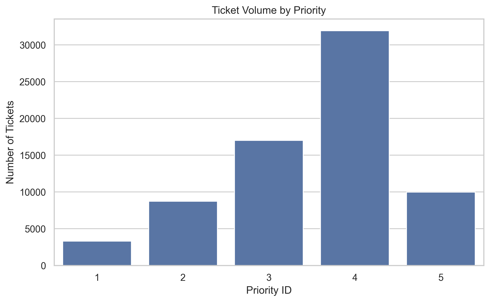
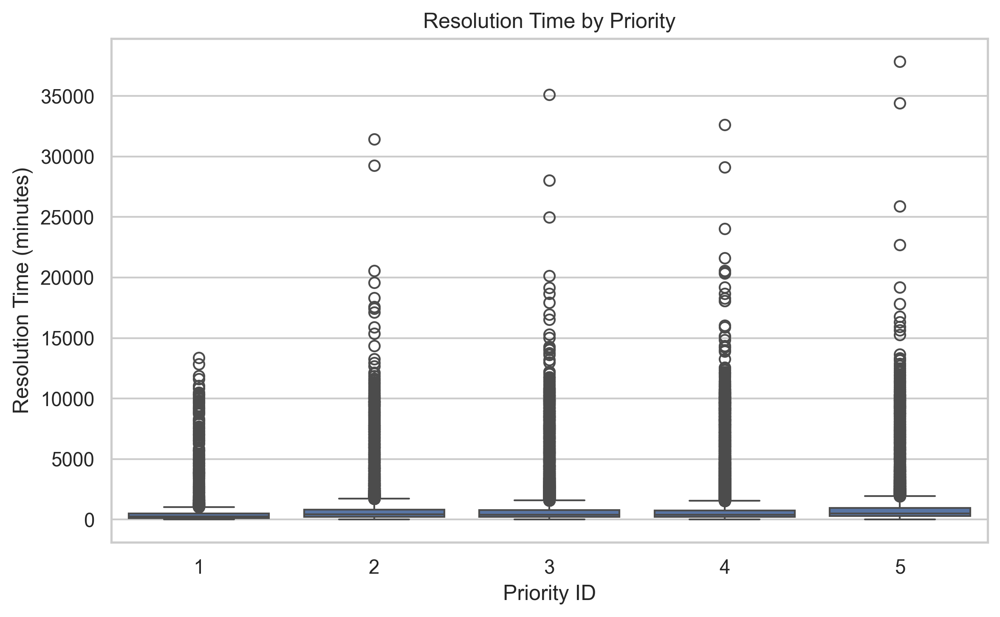
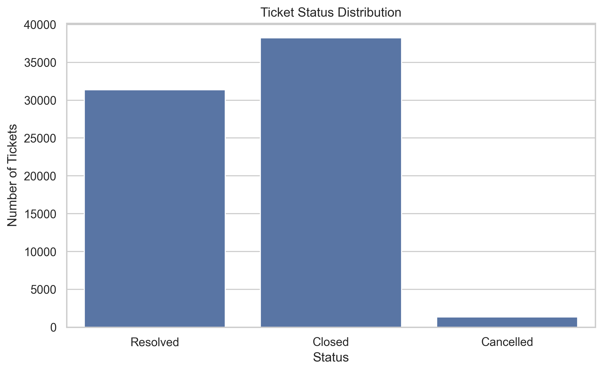
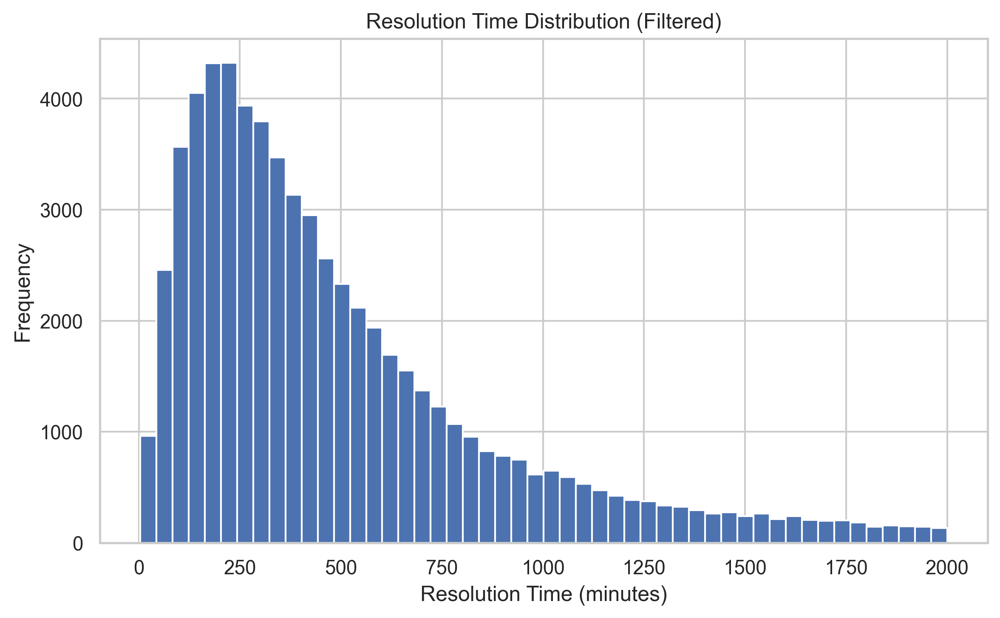
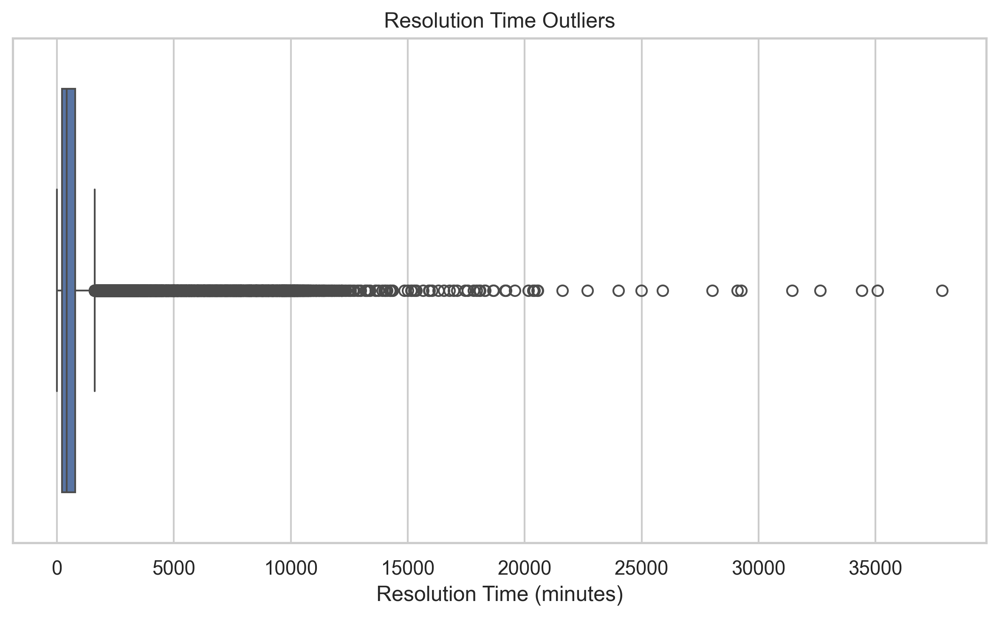
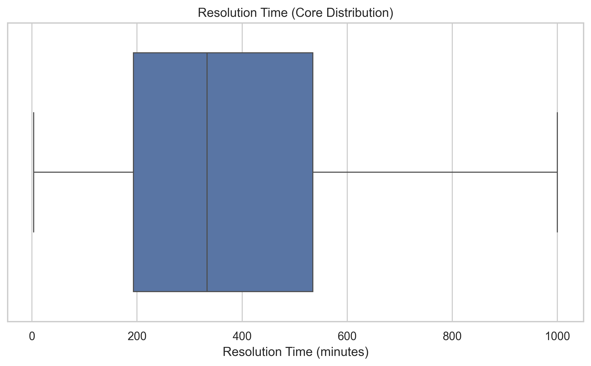

# EDA Visualizations

This document presents the main visual insights from the exploratory data analysis.

---

## Ticket volume by priority

- Most tickets are concentrated in medium priority levels.
- Priority 4 represents the largest workload segment.
- High priority tickets are less frequent.

---

## Resolution time by priority

- Resolution time varies across all priority levels.
- No strong difference between priorities in terms of median.
- High variability suggests other influencing factors.

---

## Ticket status distribution

- Most tickets are completed (Closed or Resolved).
- Cancelled tickets are minimal.
- The support process appears stable.

---

## Resolution time distribution (filtered)

- Most tickets are resolved within a consistent time range.
- Distribution is right-skewed.
- Extreme values distort the full distribution.

---

## Resolution time outliers

- A significant number of extreme values exist.
- These outliers impact SLA metrics.

---

## Resolution time core distribution

- Filtering reveals the true operational behavior.
- Most tickets follow a consistent resolution pattern.